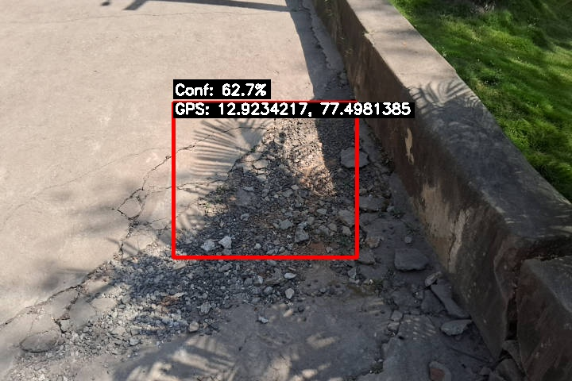
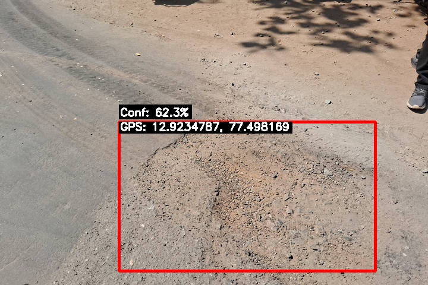
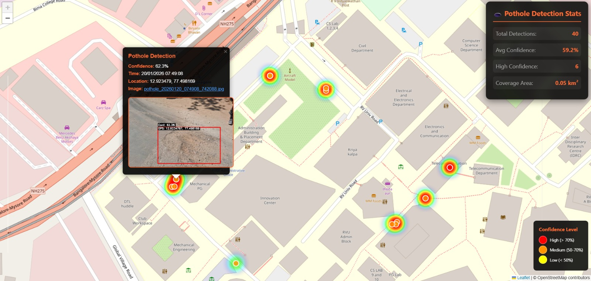
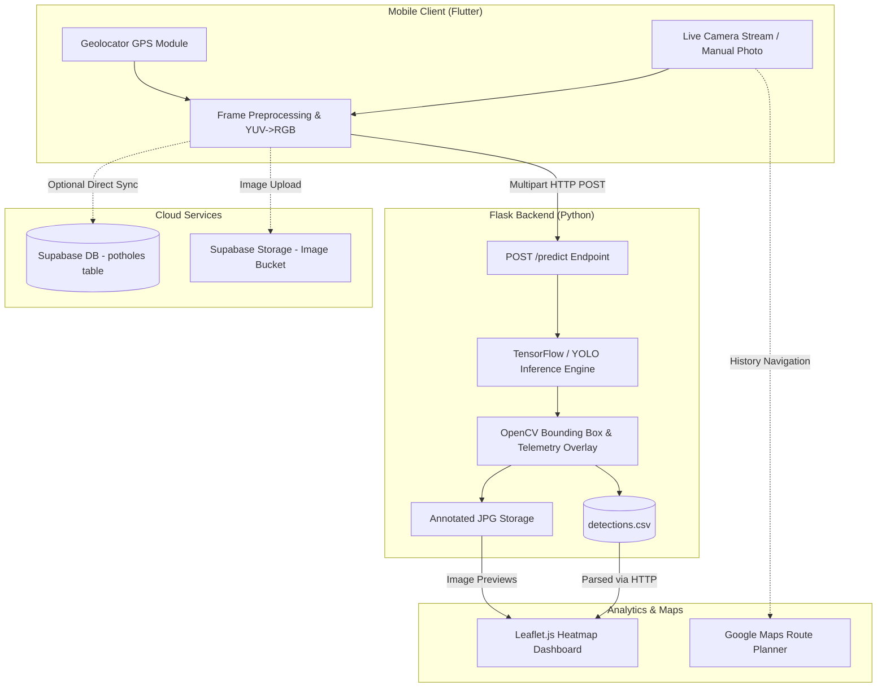

# Road Guardian — Smart Pothole Detection & Mapping System

<p align="center">
  
  
  
  
  
  
  
  
</p>

<p align="center">
  <b>An end-to-end intelligent road hazard detection ecosystem:</b> Capture video frames from mobile devices, detect potholes in real time with custom computer vision models, tag them with precise GPS coordinates, and visualize road conditions through an interactive geospatial heatmap.
</p>

---

## Visual Showcase & Detections

### Real-Time Pothole Detections (with GPS & Confidence Telemetry)
<p align="center">
  
  
</p>

### Interactive Geospatial Heatmap
<p align="center">
  
  <br/>
  <em>Interactive Leaflet.js dashboard with live confidence filtering, cluster statistics, and image previews.</em>
</p>

---

## Key Features

- **Real-Time Edge & Cloud Detection**: Detect road potholes instantly from live camera streams or uploaded pictures using trained **SSD MobileNet V2 (TensorFlow)** and **YOLOv8** models.
- **Telemetry & GPS Geo-Tagging**: Every detected pothole is automatically annotated with bounding boxes, confidence percentages, timestamp, and GPS coordinates (Latitude/Longitude).
- **Interactive Heatmap & Spatial Analytics**: View city-wide or route-specific road hazards on a responsive Leaflet-powered heatmap with confidence color grades (High, Medium, Low) and photo popups.
- **Cross-Platform Flutter Mobile Apps**:
  - **Live Feed Mode**: Continuous background camera stream analysis with intelligent cooldowns to avoid duplicate alerts.
  - **Manual Capture & Inspection**: Photo capture with viewfinder guides, zoom gesture controls, and gallery uploads.
  - **Detection History & Route Navigation**: Local inspection log with direct one-tap directions via Google Maps or multi-stop route plotting.
- **Cloud & Local Storage Flexibility**: Supports direct CSV/filesystem logging as well as cloud synchronization with **Supabase** database and storage.
- **Model Conversion Pipeline**: Automated converters to export TensorFlow / YOLO models to lightweight `.tflite` and `.onnx` formats for on-device inference.

---

## System Architecture



---

## Repository Structure

```
├── Android Models/              # Pretrained ONNX and TFLite edge models & labels
│   ├── ColabModel.onnx
│   ├── KaggleModel.tflite
│   └── labels.txt
├── backend/                     # Python Flask API & analytics service
│   ├── main.py                  # Core inference API & image annotation engine
│   ├── convert_to_tflite.py     # TFLite model optimization script
│   ├── requirements.txt         # Backend Python dependencies
│   ├── exported-model/          # TensorFlow SavedModel directory
│   └── detections/              # Annotated images, CSV records & heatmap server
│       ├── detections.csv       # Recorded detections log
│       ├── heatmap.html         # Leaflet.js interactive heatmap UI
│       └── serve_heatmap.py     # Dedicated HTTP server for the heatmap
├── docs/                        # Project documentation & screenshots
│   └── screenshots/             # Sample detections, heatmap, and UI previews
├── front_end/                   # Comprehensive Flutter mobile application
│   ├── lib/
│   │   ├── main.dart            # App entry point with Supabase initialization
│   │   ├── screens/             # LiveFeed, CameraScreen, HistoryScreen, Results
│   │   └── services/            # TFLiteService, DetectionService, Permissions
│   └── pubspec.yaml
├── holeyea/                     # Streamlined dark-mode Flutter mobile application
│   ├── lib/
│   │   ├── router.dart          # GoRouter routing setup
│   │   ├── ui/                  # Home, Manual Detection & Live Feed UI
│   │   └── viewmodels/          # Camera streaming & real-time frame dispatcher
│   └── pubspec.yaml
├── ModelTraining/               # Model training scripts and Google Colab notebooks
│   ├── HoleYeahFinal.ipynb      # YOLOv8 nano training, validation & export pipeline
│   └── readme.txt
└── web/                         # Bun + Elysia TypeScript web interface scaffold
```

---

## Quick Start Guide

### 1. Setup & Run the Python Backend

#### Prerequisites:
* Python 3.8+
* `pip` package manager

```bash
# 1. Navigate to the backend directory
cd backend

# 2. (Optional but recommended) Create a virtual environment
python -m venv venv
# On Windows:
venv\Scripts\activate
# On Linux/macOS:
source venv/bin/activate

# 3. Install required dependencies
pip install -r requirements.txt

# 4. Start the inference backend
python main.py
```
> The API will be live at `http://localhost:5000` (or `http://0.0.0.0:5000`).

---

### 2. Run the Heatmap Visualization Server

To view the interactive pothole map in your browser:

```bash
# From the backend/detections directory
cd backend/detections

# Launch the heatmap server
python serve_heatmap.py
```
Open [http://localhost:8000/heatmap.html](http://localhost:8000/heatmap.html) in your browser.

---

### 3. Run the Mobile App (Flutter)

#### Prerequisites:
* [Flutter SDK (v3.7+)](https://docs.flutter.dev/get-started/install)
* Android Studio / Xcode / Connected Physical Device

#### Configuration:
Open the backend configuration in the Flutter app to point to your PC's IP address on the local network (e.g. `http://192.168.x.x:5000/predict`):
* In `front_end/lib/services/tflite_service.dart` -> `backendUrl`
* In `holeyea/lib/viewmodels/feed_view_model.dart` -> `backendUrl`

#### Running the App:
```bash
# Choose which Flutter client you want to run:
cd front_end
# or: cd holeyea

# Fetch packages
flutter pub get

# Run on connected device or emulator
flutter run
```

---

## API Reference

### `GET /`
Health check endpoint.
* **Response `200 OK`**:
  ```json
  {
    "status": "Backend is running!",
    "ip": "192.168.1.15"
  }
  ```

---

### `POST /predict`
Performs object detection on an uploaded image, saves the annotated image with GPS overlay, and logs telemetry to CSV.

* **Headers**: `Content-Type: multipart/form-data`
* **Form Data**:
  * `file`: Binary image file (`.jpg` / `.png`) *(required)*
  * `lat`: Latitude string e.g. `"12.92356"` *(optional)*
  * `long`: Longitude string e.g. `"77.50032"` *(optional)*

* **Response `200 OK`**:
  ```json
  [
    {
      "label": "pothole",
      "confidence": 0.8924,
      "bbox": [142, 310, 480, 520]
    }
  ]
  ```

---

## Tech Stack

| Domain | Technologies Used |
|---|---|
| **Computer Vision & ML** | SSD MobileNet V2 (TensorFlow 2.x), YOLOv8 Nano, OpenCV, ONNX, TFLite |
| **Backend & API** | Python, Flask, Flask-CORS |
| **Mobile Frontend** | Flutter, Dart, Provider, GoRouter, Camera Plugin, Geolocator |
| **Geospatial & Mapping** | Leaflet.js, OpenStreetMap, Leaflet.heat, Google Maps API |
| **Cloud & Database** | Supabase (PostgreSQL Database & Storage Buckets) |
| **Web Service Scaffold** | TypeScript, Bun, Elysia.js |

---

## Contributing

Contributions, issues, and feature requests are welcome!
1. Fork the Project
2. Create your Feature Branch (`git checkout -b feature/AmazingFeature`)
3. Commit your Changes (`git commit -m 'Add some AmazingFeature'`)
4. Push to the Branch (`git push origin feature/AmazingFeature`)
5. Open a Pull Request

---

## License

This project is licensed under the [MIT License](LICENSE).
